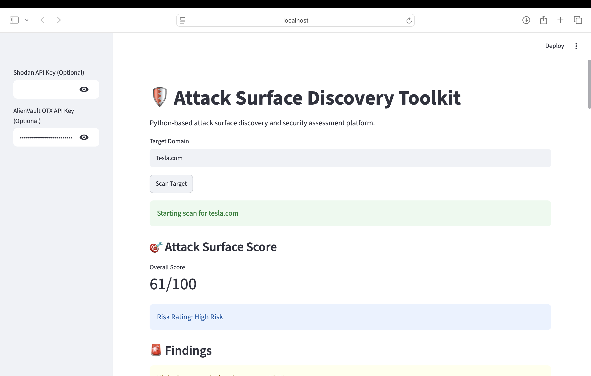
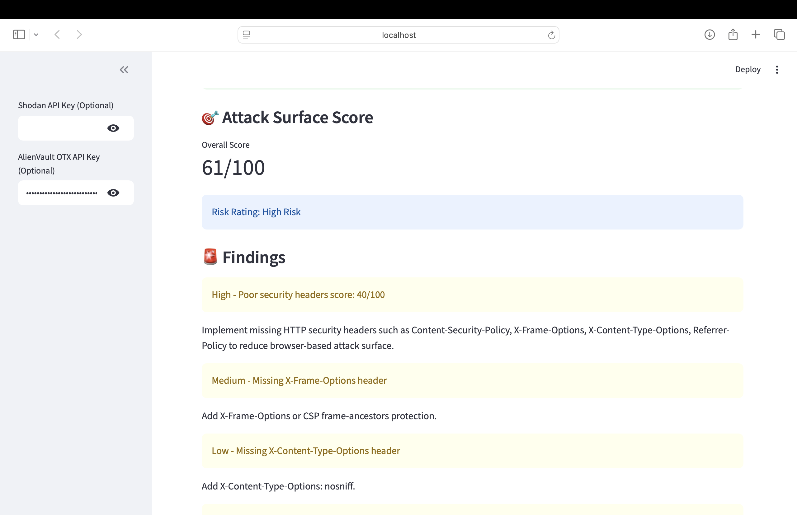
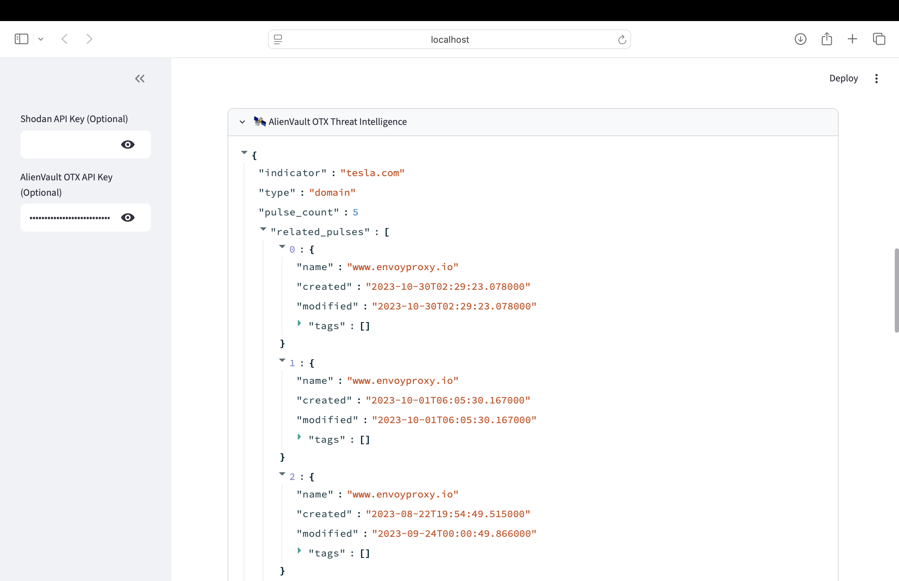
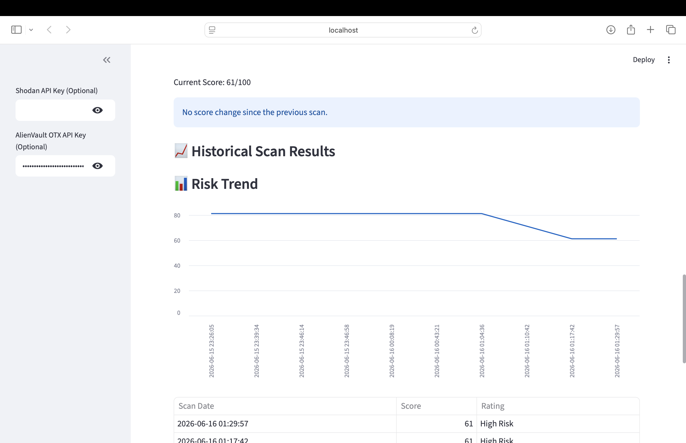

# Attack Surface Discovery Toolkit

Python-based Attack Surface Management (ASM) and Security Assessment Platform designed to identify externally exposed assets, assess security posture, enrich findings with threat intelligence, and track attack surface risk over time.

---

## Overview

Attack Surface Discovery Toolkit helps security professionals identify, assess, and monitor internet-facing assets. The platform combines attack surface discovery, security posture assessment, threat intelligence enrichment, risk scoring, historical tracking, and automated reporting within a single Streamlit dashboard.

The project was built to simulate Attack Surface Management (ASM) and Exposure Management workflows commonly used by security operations, vulnerability management, and threat intelligence teams.

## Live Demo

🚀 https://attack-surface-discovery-toolkit.streamlit.app

## Key Features

### Attack Surface Discovery

* DNS Enumeration
* WHOIS Intelligence
* SSL Certificate Analysis
* Port Scanning
* Subdomain Enumeration
* Technology Fingerprinting

### Security Assessment

* Security Headers Analysis
* Attack Surface Risk Scoring
* Risk Rating Classification
* Findings and Recommendations Engine

### Threat Intelligence

* AlienVault OTX Threat Intelligence Integration
* Optional Shodan Intelligence Integration

### Historical Analysis

* SQLite Historical Scan Database
* Current vs Previous Scan Comparison
* Historical Risk Tracking
* Risk Trend Visualization

### Reporting

* HTML Report Export
* PDF Report Export
* JSON Report Export

### Dashboard

* Interactive Streamlit Dashboard
* Attack Surface Score Visualization
* Findings Dashboard
* Threat Intelligence Enrichment
* Historical Scan Tracking

---

## Technology Stack

* Python
* Streamlit
* SQLite
* Requests
* dnspython
* python-whois
* AlienVault OTX API
* Shodan API (Optional)

---

## Dashboard Screenshots

### Dashboard Overview



### Attack Surface Risk Assessment



### Threat Intelligence Enrichment



### Historical Risk Tracking



---

## Example Workflow

1. Enter a target domain.
2. Perform DNS, WHOIS, SSL, and port analysis.
3. Identify exposed services and technologies.
4. Analyze HTTP security headers.
5. Enrich findings with threat intelligence.
6. Calculate attack surface risk score.
7. Compare against previous assessments.
8. Export results as HTML, PDF, or JSON reports.

---

## Installation

Clone the repository:

```bash
git clone https://github.com/btncwn/Attack-Surface-Discovery-Toolkit.git
cd Attack-Surface-Discovery-Toolkit
```

Create and activate a virtual environment:

```bash
python3 -m venv venv
source venv/bin/activate
```

Install dependencies:

```bash
pip install -r requirements.txt
```

Launch the application:

```bash
python -m streamlit run app.py
```

---

## Optional API Integrations

### AlienVault OTX

Create a free AlienVault OTX account and generate an API key.

The API key can be entered directly in the dashboard sidebar.

### Shodan

Shodan enrichment is supported when a valid API plan is available.

The API key can be entered directly in the dashboard sidebar.

### Security Note

API keys are not stored by the application.

AlienVault OTX and Shodan API keys are entered manually in the Streamlit dashboard and are only used during the active scan session.

---

## Use Cases

* Attack Surface Management (ASM)
* Security Posture Assessment
* Exposure Management
* Threat Intelligence Enrichment
* Vulnerability Identification
* Security Research
* Cybersecurity Portfolio Demonstration

---

## Future Enhancements

* CVE Enrichment
* Additional Threat Intelligence Sources
* Scheduled Assessments
* Exposure Change Alerts
* Asset Inventory Management

---

## Disclaimer

This project is intended for educational, research, and authorized security assessment purposes only.

Always obtain permission before scanning systems you do not own or administer.
